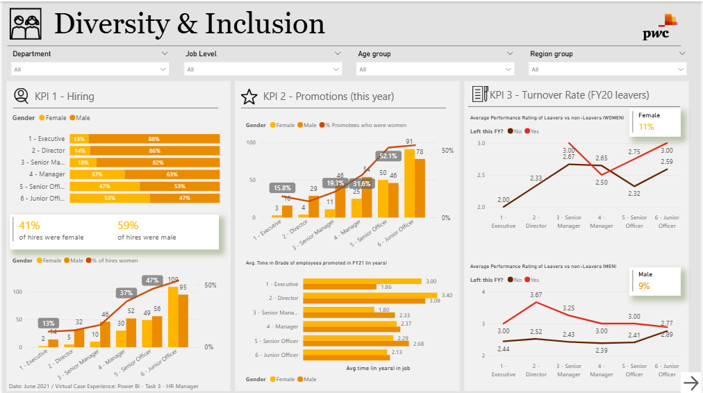
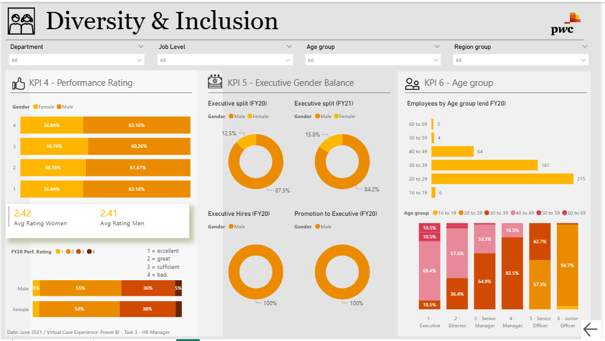

# 👥 PwC Diversity & Inclusion Analytics Dashboard

An interactive two-page Power BI dashboard developed as part of the **PwC Virtual Case Experience**. This project analyzes workforce diversity, equity, and inclusion (DEI) metrics to evaluate hiring, promotions, employee retention, performance ratings, and executive gender balance. The dashboard provides actionable HR insights to support data-driven diversity and inclusion strategies.

---

## 📊 Dashboard Previews

### Page 1 – Recruitment, Promotion & Turnover Analysis

> Save the screenshot as **`page1_preview.png`**.



---

### Page 2 – Performance Ratings & Executive Diversity

> Save the screenshot as **`page2_preview.png`**.



---

## 🎯 Project Objectives

- Analyze workforce diversity across different job levels.
- Evaluate gender representation in hiring and promotions.
- Measure employee turnover and promotion timelines.
- Compare performance ratings between male and female employees.
- Monitor executive gender balance over financial years.
- Support HR leaders in making data-driven DEI decisions.

---

## 📊 Dashboard Features

## 📋 Page 1 – Recruitment, Promotion & Turnover

### 1. Hiring Analysis

**Dashboard Highlights**

- Gender distribution of new hires
- Hiring breakdown across organizational levels
- Comparison of female and male hiring percentages

**Key Findings**

- Female Hires: **41%**
- Male Hires: **59%**
- Female representation is highest at the Junior Officer level and decreases significantly at Executive positions.

---

### 2. Promotion Analysis

**Dashboard Highlights**

- Promotion distribution by gender
- Promotion comparison across job grades
- Executive promotion trends

**Key Findings**

- Women account for **52.1%** of Senior Officer promotions.
- Women represent only **15.8%** of Executive promotions.

---

### 3. Promotion Timeline

**Dashboard Highlights**

- Average years required for promotion
- Promotion timeline comparison across genders
- Career progression analysis

**Key Findings**

- Average promotion time ranges between **1.8** and **3.4 years** across job levels.

---

### 4. Employee Turnover

**Dashboard Highlights**

- Employee attrition analysis
- Turnover comparison by gender
- Performance versus turnover relationship

**Key Findings**

- Female Turnover Rate: **11%**
- Male Turnover Rate: **9%**

---

## 📋 Page 2 – Performance & Workforce Diversity

### 1. Performance Ratings

**Dashboard Highlights**

- Performance rating distribution
- Average rating comparison by gender
- Rating scale analysis

**Key Findings**

- Female Average Rating: **2.42**
- Male Average Rating: **2.41**

---

### 2. Executive Gender Balance

**Dashboard Highlights**

- Executive representation over financial years
- Leadership diversity trends
- Executive hiring and promotion analysis

**Key Findings**

- Female Executive Representation
  - FY20: **12.5%**
  - FY21: **15.8%**

---

### 3. Workforce Age Distribution

**Dashboard Highlights**

- Employee distribution by age group
- Age comparison across job levels
- Workforce demographic analysis

**Key Findings**

- 20–29 Years: **215 employees**
- 30–39 Years: **161 employees**

---

## 📈 Key Insights

- Male employees represented the majority of overall hiring.
- Female representation declined significantly at executive leadership levels.
- Promotion opportunities became less balanced at higher organizational positions.
- Performance ratings remained nearly identical across genders.
- Female employee turnover was slightly higher than male turnover.
- The majority of the workforce belonged to the 20–39 age group.
- Executive diversity improved slightly between FY20 and FY21.

---

## 🛠️ Tech Stack

- **Visualization Tool:** Power BI Desktop
- **Data Transformation:** Power Query
- **Data Analysis:** DAX (Data Analysis Expressions)
- **Visualizations:** KPI Cards, Bar Charts, Line Charts, Donut Charts, Matrix Tables, Slicers
- **Project Context:** PwC Virtual Case Experience – HR Analytics
- **Dashboard Design:** Interactive corporate dashboard with cross-filtering and drill-down functionality

---

## ✨ Features

- Two-page interactive dashboard
- Workforce diversity analysis
- Hiring and promotion tracking
- Employee turnover analysis
- Performance rating comparison
- Executive gender balance monitoring
- Workforce demographic analysis
- Interactive filters and cross-filtering
- Executive HR reporting

---

## 🚀 Future Enhancements

- Department-wise diversity analysis.
- Predictive employee attrition modeling.
- Diversity scorecards by business unit.
- Inclusion survey analysis.
- Real-time HR dashboard integration.
- Advanced drill-through reports.

---

## 📂 Folder Structure

```text
PowerBI-Data-Analytics-Portfolio/
├── Amazon-Prime-Video-Analytics/
├── College-Analysis-Dashboard/
├── Corporate-Sales-Performance-Dashboard/
├── Employee-Attrition-Dashboard/
├── HR-Analytics-Dashboard/
├── Job-Market-Analysis-Dashboard/
├── PwC-Diversity-Inclusion-Dashboard/
│   ├── README.md
│   ├── Diversity & Inclusion.pbix
│   ├── page1_preview.png          # Dashboard Page 1 preview
│   └── page2_preview.png          # Dashboard Page 2 preview
├── Student-Depression-Analysis-Dashboard/
└── Supermarket-Sales-Dashboard/
```

---

## 📌 Conclusion

This Power BI dashboard provides a comprehensive analysis of workforce diversity, inclusion, and employee performance by combining hiring, promotions, turnover, leadership representation, and workforce demographics into an interactive HR analytics solution. It enables HR professionals and organizational leaders to identify diversity gaps, monitor inclusion initiatives, and make informed, data-driven decisions that foster a more equitable workplace.
