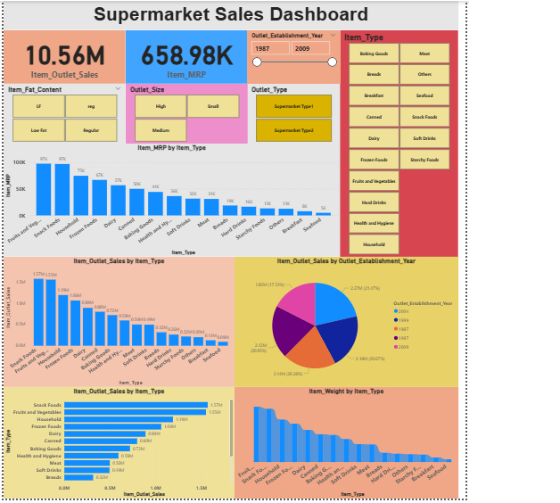

# 🛒 Supermarket Sales Dashboard

An interactive Power BI dashboard that provides a comprehensive overview of supermarket sales performance, product pricing, outlet characteristics, and inventory trends. The dashboard transforms retail transaction data into actionable insights, enabling business stakeholders to evaluate sales performance, compare outlet efficiency, and optimize inventory management.

---

## 📊 Dashboard Preview

> Save your dashboard screenshot in this folder as **`dashboard_preview.png`**.



---

## 🎯 Project Objectives

- Analyze overall supermarket sales performance.
- Compare revenue across different product categories.
- Evaluate product pricing (MRP) trends.
- Analyze outlet performance by size, type, and establishment year.
- Understand inventory distribution using item weight analysis.
- Enable interactive exploration through dynamic filters and slicers.

---

## 📊 Dashboard Features

### 1. Executive Summary

Provides a high-level overview of retail performance through KPI cards.

**Key Metrics**
- **Total Item Outlet Sales:** **10.56M**
- **Total Item MRP:** **658.98K**
- **Outlet Establishment Timeline:** **1987 – 2009**

---

### 2. Interactive Filters

**Dashboard Highlights**
- Item Fat Content
  - Low Fat
  - Regular
  - LF
  - Reg
- Outlet Size
  - Small
  - Medium
  - High
- Outlet Type
  - Supermarket Type1
  - Supermarket Type2
- Item Type Selector for detailed product analysis

---

### 3. Product Performance Analysis

**Dashboard Highlights**
- Item MRP by Item Type
- Item Outlet Sales by Item Type
- Comparison of sales across all product categories
- Top-performing categories include:
  - Snack Foods
  - Fruits and Vegetables
  - Household Products

---

### 4. Outlet Performance Analysis

**Dashboard Highlights**
- Revenue by Outlet Establishment Year
- Sales comparison across outlet age groups
- Revenue contribution by store vintage

**Key Findings**
- 2004 outlets contributed **21.47%** of total sales.
- 1999 outlets contributed **20.67%** of total sales.

---

### 5. Inventory & Logistics Analysis

**Dashboard Highlights**
- Item Weight distribution by Item Type
- Product weight comparison across inventory categories
- Supports logistics and inventory planning

---

## 📈 Key Insights

- Generated **10.56M** in total outlet sales.
- Snack Foods and Fruits & Vegetables were the highest revenue-generating categories.
- Product pricing varied significantly across different item types.
- Older outlets established in **1999** and **2004** contributed the largest share of revenue.
- Interactive slicers enable detailed analysis based on outlet size, outlet type, and product characteristics.
- Item weight analysis provides insights for inventory and supply chain optimization.

---

## 🛠️ Tech Stack

- **Visualization Tool:** Power BI Desktop
- **Data Transformation:** Power Query
- **Data Analysis:** DAX (Data Analysis Expressions)
- **Visualizations:** KPI Cards, Bar Charts, Pie Charts, Area Charts, Slicers, Interactive Filters
- **Dashboard Design:** Interactive retail analytics dashboard with cross-filtering and drill-down capabilities

---

## ✨ Features

- Interactive KPI cards
- Dynamic slicers and filters
- Product sales analysis
- Product pricing analysis
- Outlet performance comparison
- Revenue trend visualization
- Inventory weight analysis
- Cross-filtering between visuals
- Executive retail reporting dashboard

---

## 🚀 Future Enhancements

- Sales forecasting using Machine Learning.
- Profit margin analysis by product category.
- Customer purchasing behavior analysis.
- Inventory demand forecasting.
- Real-time sales monitoring.
- Interactive drill-through reports.

---

## 📂 Folder Structure

```text
PowerBI-Data-Analytics-Portfolio/
├── Amazon-Prime-Video-Analytics/
├── College-Analysis-Dashboard/
├── Corporate-Sales-Performance-Dashboard/
├── Employee-Attrition-Dashboard/
├── HR-Analytics-Dashboard/
├── Job-Market-Analysis-Dashboard/
├── Student-Depression-Analysis-Dashboard/
└── Supermarket-Sales-Dashboard/
    ├── README.md
    ├── SUPER MARKET SALES.pbix
    └── dashboard_preview.png          # Dashboard preview image
```

---

## 📌 Conclusion

This dashboard provides a comprehensive overview of supermarket operations by combining sales performance, product pricing, outlet characteristics, and inventory analysis into a single interactive Power BI report. It enables retailers and business managers to make informed, data-driven decisions through intuitive visualizations and dynamic business insights.
